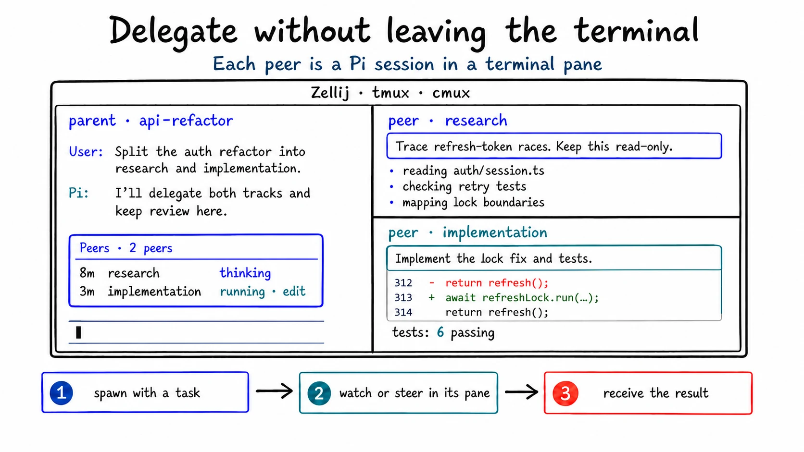
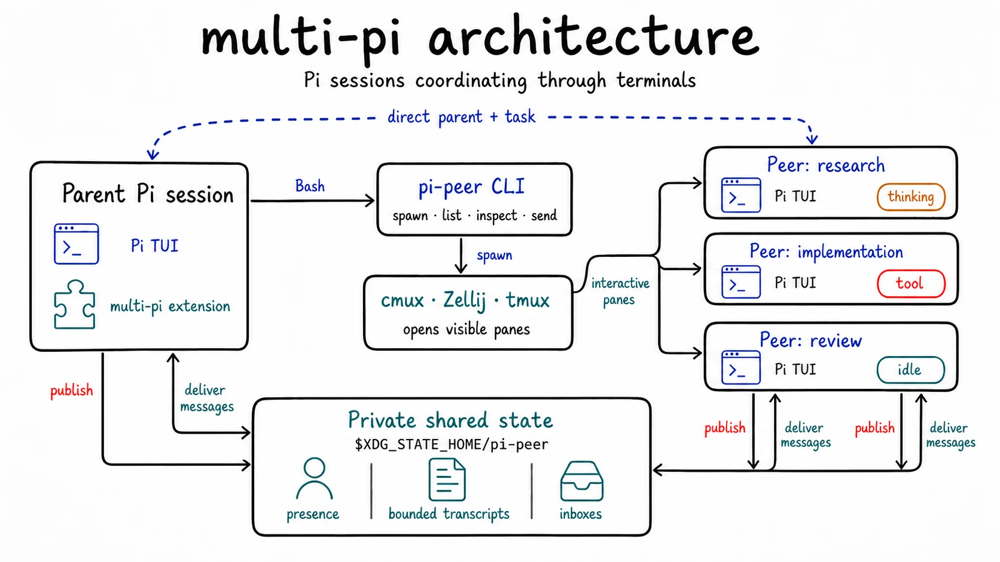

# multi-pi

Coordinate [Pi](https://github.com/earendil-works/pi) sessions through the
`pi-peer` CLI. Each peer keeps Pi's TUI, steering,
cancellation, resume, and quit controls in a neighboring terminal pane.

Pi uses its Bash tool plus a progressively disclosed skill to invoke the
CLI. The bundled runtime extension registers no model-facing tools; it publishes
presence and bounded transcripts, delivers inbox messages, preserves delegation
lineage, and renders the parent status widget.



## Install

`multi-pi` supports Pi on macOS and Linux.

| Setup | Spawn panes | List, inspect, and send |
| --- | :---: | :---: |
| macOS with cmux | ✓ | ✓ |
| macOS or Linux with Zellij 0.45+ or tmux | ✓ | ✓ |
| Separately started Pi sessions | N/A | ✓ |
| Windows | N/A | N/A |

Install the published Pi package:

```sh
pi install npm:@vcfgdev/multi-pi
```

Or install a development checkout:

```sh
git clone https://github.com/vcfgdev/multi-pi.git
pi install /absolute/path/to/multi-pi
```

The runtime extension adds the package's bundled `pi-peer` executable to Bash's
`PATH` inside Pi. To use the CLI directly from a human shell as well, link it into
an existing `PATH` directory:

```sh
ln -s /absolute/path/to/multi-pi/bin/pi-peer ~/.local/bin/pi-peer
```

Start Pi inside cmux, Zellij, or tmux to spawn panes. For example:

```sh
zellij --session pi-peers
pi
```

## CLI

Use command-level help for exact syntax:

```sh
pi-peer --help
pi-peer spawn --help
pi-peer send --help
```

Spawn a peer with a task on stdin:

```sh
pi-peer spawn --name refresh-race --cwd "$PWD" <<'EOF'
Trace how concurrent token refresh requests are serialized. Return the verified
call path, race window, relevant tests, and smallest safe fix. Keep this read-only.
EOF
```

Inspect and steer it:

```sh
pi-peer list
pi-peer inspect refresh-race
pi-peer send refresh-race --kind steer <<'EOF'
The refresh token may remain nullable; focus on duplicate outbound requests.
EOF
```

A delegated peer can omit its parent target when returning a result:

```sh
pi-peer send --kind result <<'EOF'
The refresh lock covers token persistence but not the first retry. Findings...
EOF
```

Every command supports stable JSON output with `--json`. `inspect` returns at
most 20 transcript records by default and accepts `--limit` from 1 through 100.

## Architecture



## Root and child sessions

When invoked by Pi's Bash tool, `spawn` reads `PI_SESSION_ID` and records it as
the new session's direct parent. A child can spawn another child without losing
that direct relationship. When `PI_SESSION_ID` is absent, `spawn` creates an
independent root.

The startup environment only bootstraps lineage. The runtime extension persists
lineage in Pi's session history, restores it on resume or fork, and clears it for
a new session. There can be several independent roots; “main” is not a global
role. CLI JSON identifies each live session as `"role": "root"` or
`"role": "peer"` from the presence or absence of direct-parent lineage.

## Runtime state

Live sessions coordinate through private files under
`$XDG_STATE_HOME/pi-peer`, or `~/.local/state/pi-peer` when `XDG_STATE_HOME` is
unset.

| Variable | Purpose |
| --- | --- |
| `PI_PEER_STATE_DIR` | Override the shared coordination directory |
| `MULTI_PI_STATE_DIR` | Legacy alias for `PI_PEER_STATE_DIR` |
| `PI_PEER_PARENT_SESSION_ID` | Current session's direct parent |
| `PI_PEER_PARENT` | Legacy alias for `PI_PEER_PARENT_SESSION_ID` |
| `PI_PEER_TASK_ID` | Current session's delegated task |

The launcher removes caller-scoped `PI_SESSION_*`, provider, model, reasoning,
lineage, and terminal-pane variables before starting a child. It then sets only
the child's direct parent and task lineage.

## Why interactive peers?

| multi-pi | Typical managed subagent |
| --- | --- |
| Pi TUI in a pane | Worker may run behind a tool call |
| Native steering, cancellation, and resume | Interaction follows framework controls |
| Pi session history | Framework often owns worker lifecycle |
| CLI available through Bash | Dedicated tools or MCP schemas stay in context |

Task completion remains a user-and-agent judgment. An `idle` peer is waiting for
input; completion is separate.

## Develop

The checkout pins Node and Bun with [mise](https://mise.jdx.dev/):

```sh
cd /path/to/multi-pi
mise install
mise exec -- bun install --frozen-lockfile
mise run check
```

Load the checkout in one development session with:

```sh
mise exec -- bun run pi -- -e .
```

## Acknowledgements

- [`pi-intercom`](https://github.com/nicobailon/pi-intercom)
- [`pi-subagents`](https://github.com/nicobailon/pi-subagents)
